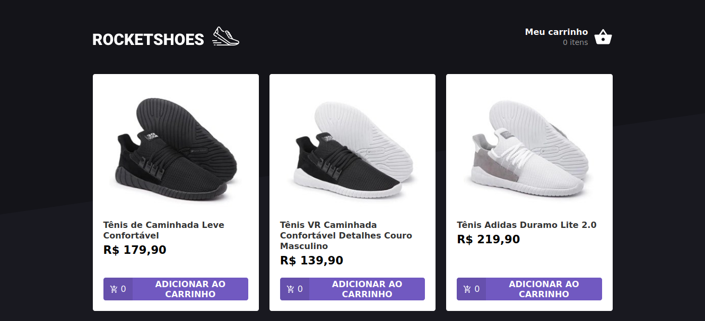
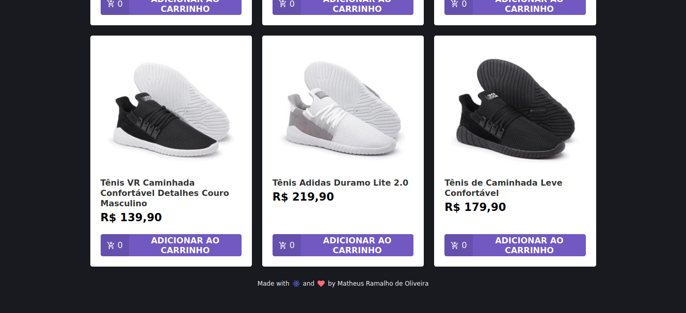
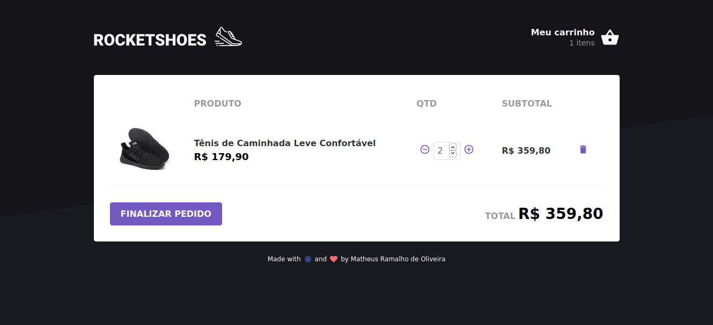
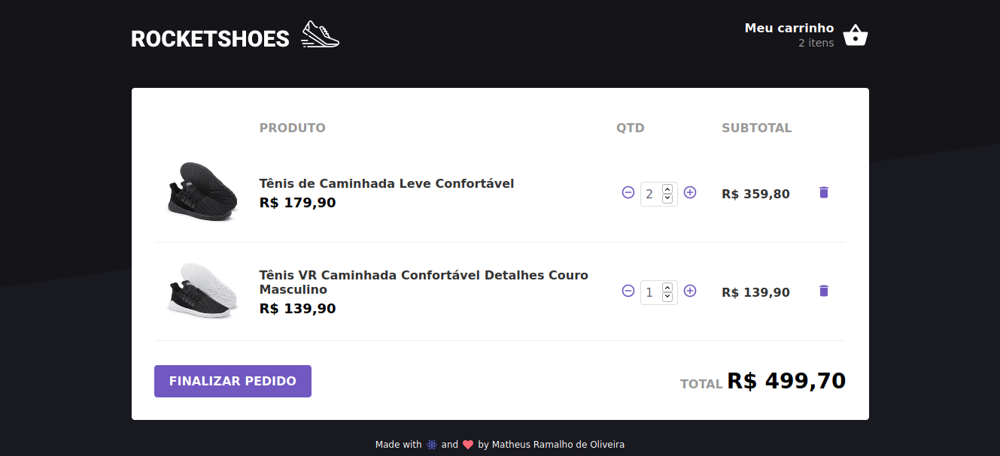
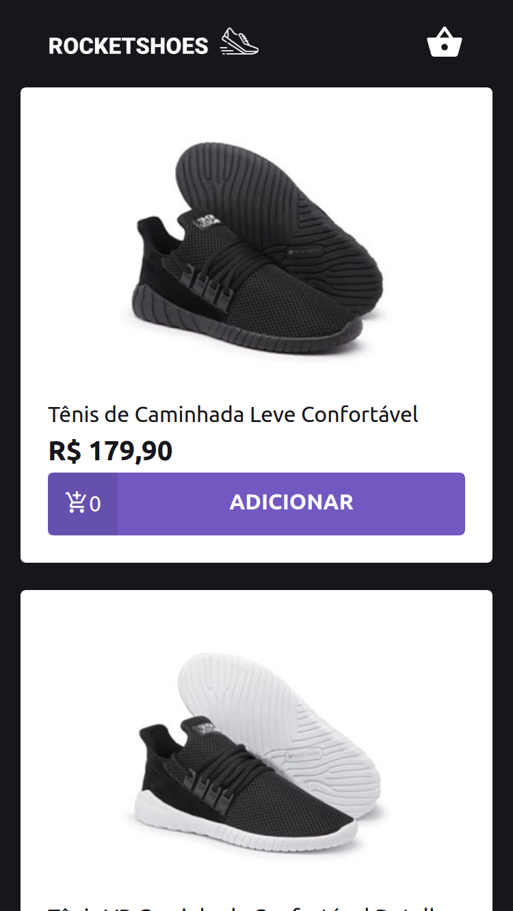
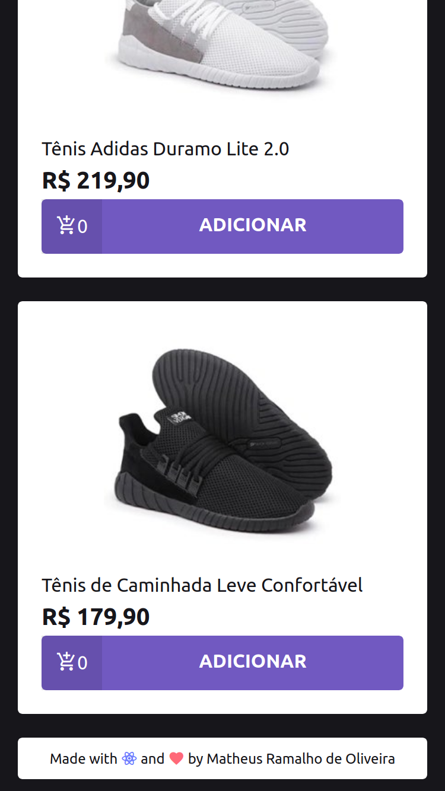
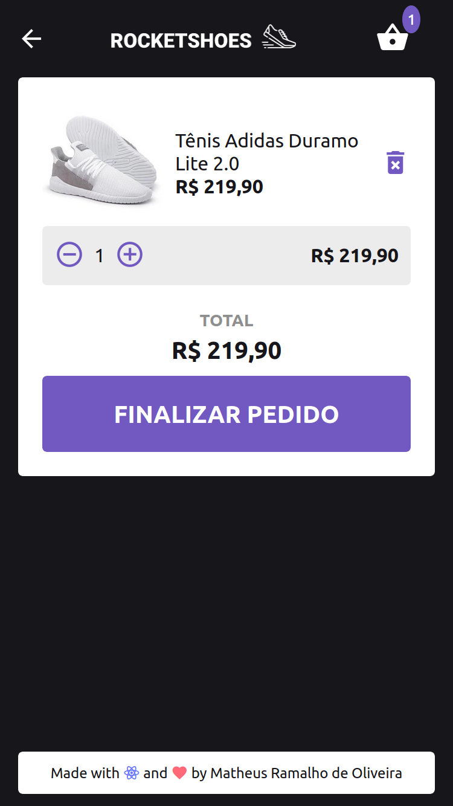
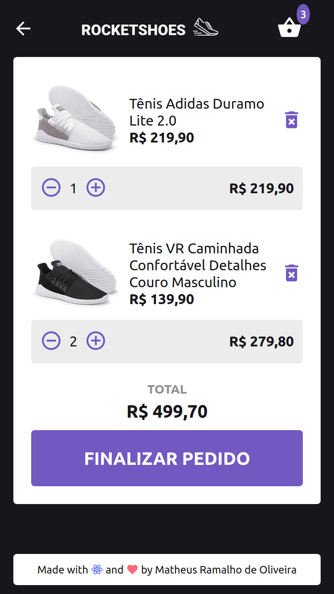
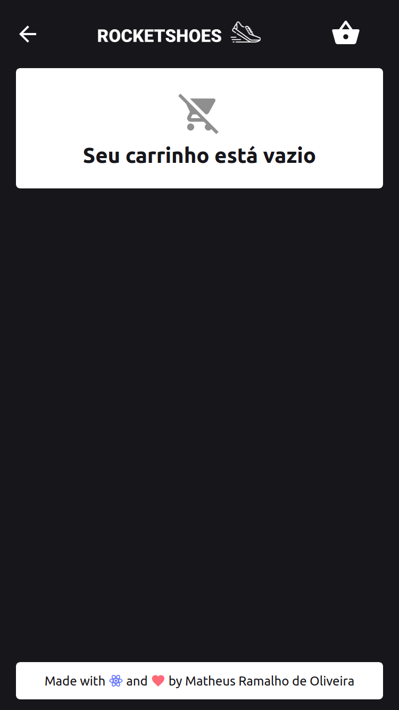

## GoStack Bootcamp Challenge 7
> 🚀 Practical project of the [Rocketseat](https://rocketseat.com.br) GoStack Bootcamp.  
👷 Developed by Matheus Ramalho de Oliveira.  
🔨 Systems Analyst, Full-Stack Developer.  
🏡 Goiânia, Goiás, Brasil.  
✉️ kastorcode@gmail.com  
👍 [instagram.com/kastorcode](https://www.instagram.com/kastorcode)

---

### Frontend Screenshots

  

  

  

  

### Mobile Screenshots

  

  

  

  

  

---

  

    Challenge 7: Flux Architecture

---

## :rocket: Sobre o desafio

Nesse desafio você migrará o projeto de e-commerce criado na web para dispositivos móveis utilizando React Native. O projeto terá as mesmas funcionalidades que o projeto web mas deve possuir uma interface mobile.

### Um pouco sobre as ferramentas

Utilize ESLint, Prettier, EditorConfig, React Navigation e todas outras ferramentas que vimos até aqui no mundo do React Native.

### Layout

O layout do projeto está em anexo com esse desafio. O arquivo `.sketch` (no diretório `.github`) pode ser aberto no Figma, que é uma ferramenta de prototipação online.

### Resultado:

---

### 🗓 ️Roadmap
- Introduction to Node.js
- Creating Node.js project
- Continuing Node.js project
- CSS Flexbox
- UI Design
- Introduction to React
- First project with ReactJS
- First project with React Native
- Front-end documentation
- Flux architecture
- Using React Hooks
- Server-side rendering(SSR) with ReactJS
- GraphQL
- Expo
- Creating ReactJS project
- Creating React Native project
- Animations with React Native
- Full-stack app development
- Node.js tests
- Node.js deploy
- ReactJS tests
- React Native tests
- ReactJS deploy
- React Native publication
- WebSocket with Express
- Advanced patterns at Node.js
- OmniStack SaaS(software as a service) and AdonisJS
- Final challenge
- Monorepo
